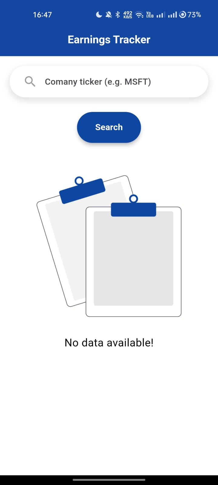
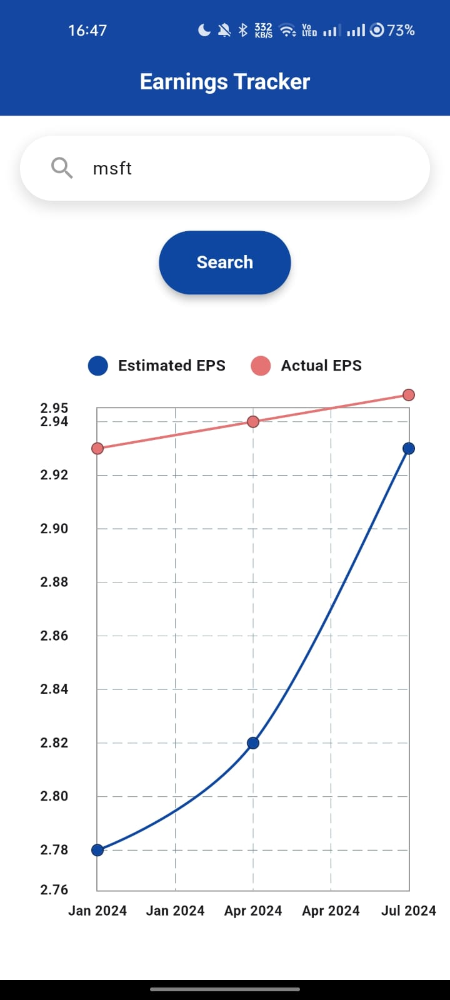
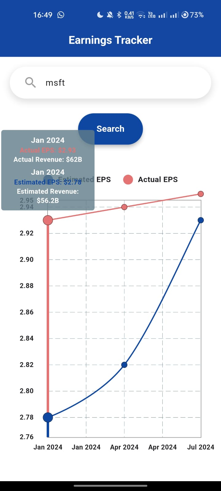
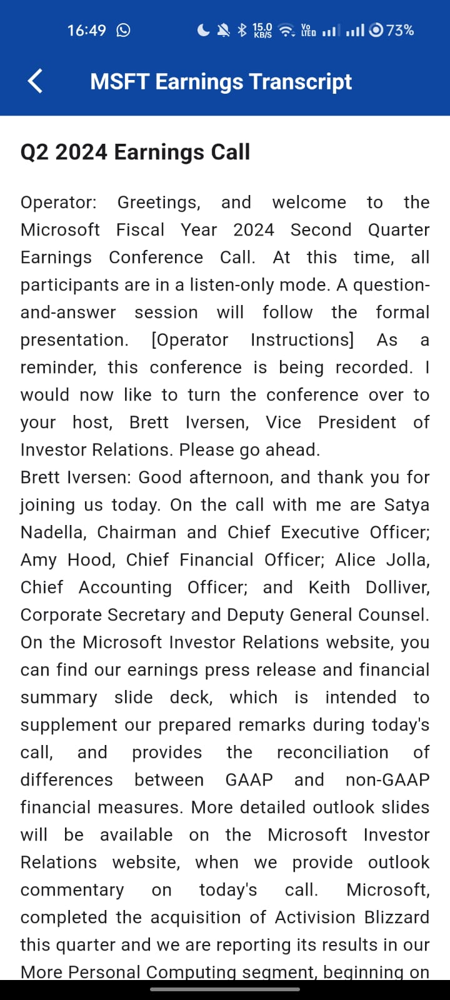

# Company Earnings Tracker

A Flutter application that visualizes and compares company earnings data, featuring interactive graphs and detailed earnings call transcripts.

## ✨ Features

* Search companies by ticker symbol
* Interactive visualization of estimated vs actual earnings
* Real-time earnings data from API Ninjas
* Detailed earnings call transcripts
* Clean and modern UI with responsive design
* Cross-platform support (iOS, Android, Web)

## Prerequisites

* Flutter SDK (latest stable version)
* Dart SDK (latest stable version)
* API Ninjas API

## 📁 Project Structure

```
lib/
├── app/
│ ├── bindings/
│ │ └── home_binding.dart          # Dependency injection for home module
│ ├── data/
│ │ ├── models/                    # Data models
│ │ │ ├── earnings_model.dart      # Earnings data structure
│ │ │ └── transcript_model.dart    # Transcript data structure
│ │ ├── providers/
│ │ │ └── api_provider.dart        # API communication layer
│ │ └── repositories/
│ │ └── earnings_repository.dart   # Business logic layer
│ ├── modules/
│ │ ├── home/
│ │ │ ├── controllers/
│ │ │ │ └── home_controller.dart   # Home screen logic
│ │ │ └── views/
│ │ │ ├── home_view.dart          # Main screen UI
│ │ │ └── components/
│ │ │ ├── earnings_graph.dart    # Interactive graph widget
│ │ │ └── transcript_view.dart   # Transcript display widget
│ │ └── shared/
│ │ ├── constants.dart           # App-wide constants
│ │ └── widgets/
│ │ └── loading_widget.dart     # Reusable loading indicator
│ ├── routes/
│ │ └── app_pages.dart            # Route definitions
│ └── themes/
│ └── app_theme.dart             # App-wide styling
└── main.dart                     # Application entry point
```

## 🚀 Setup and Installation

1. Clone the repository:
```bash
git clone https://github.com/DarkNinja15/earnings-tracker.git
cd earnings-tracker
```

2. Install dependencies:
```bash
flutter pub get
```

3. Run the application:
```bash
flutter run
```

## 🔌 API Integration

The application uses two API endpoints from API Ninjas:

1. Earnings Calendar API
   * Endpoint: `https://api.api-ninjas.com/v1/earningscalendar?ticker=MSFT`
   * Used to fetch earnings data for companies

2. Earnings Call Transcript API
   * Endpoint: `https://api.api-ninjas.com/v1/earningstranscript?ticker=MSFT&year=2024&quarter=2`
   * Used to fetch detailed earnings call transcripts

## 🧩 Key Components

### Models
* `earnings_model.dart`: Defines the structure for earnings data
* `transcript_model.dart`: Defines the structure for transcript data

### Controllers
* `home_controller.dart`: Manages the business logic for the home screen
  * Handles user input
  * Manages API calls
  * Updates UI state

### Views
* `home_view.dart`: Main screen interface
* `earnings_graph.dart`: Interactive graph component
* `transcript_view.dart`: Transcript display component


## 📊 State Management

The application uses GetX for state management, routing, and dependency injection:
* Reactive state management for real-time updates
* Clean separation of concerns
* Efficient memory management

## 📱 Screenshots

<div align="center">
  <div style="display: flex; flex-direction: row; gap: 20px; justify-content: center;">
    
    
    
  </div>
  <div style="display: flex; flex-direction: row; gap: 20px; justify-content: center;">
    
    
</div>